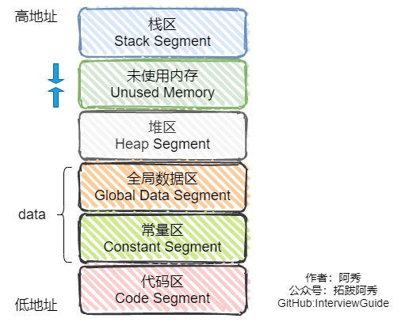
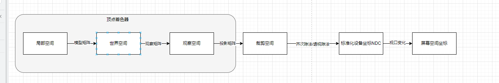

# C++

## 1 基础语法

### 1.1 类型转换

C++类型转换有四种：

1. static_cast
2. dynamic_cast
3. const_cast
4. reinterpret_cast


```
static_cast<T>(expression);
static_cast<T*>(expression);
```

静态转换有两种用法：

- 基本数据类型的转换。
- 类层次结构中分类和子类之间指针或引用的转换。

将子类的指针或引用通过静态转换为父类指针是安全的，反之不安全。static_cast仅在编译时进行类型检查。


```
dynamic_cast<T*> (expression)
```

动态转换仅支持带有虚函数的类指针或引用，转换失败返回nullptr。dynamic_cast在运行时进行类型检查。


```
const_cast<T*>(expression);
```

const_cast不会改变原始对象的const属性，若修改一个被const声明的对象，其结果是未定义的。其意义在于配合某些函数的使用。例如：

```c++
#include<iostream>
using namespace std;

const int* Search(const int* a, int n, int val);

int main()
{
    int a[10] = { 0,1,2,3,4,5,6,7,8,9 };
    int val = 5;
    int* p;
    p = const_cast<int*>(Search(a, 10, val));
    if (p == NULL)
    {
        cout << "Not found the val in array a" << endl;
    }
    else
    {
        *p = 500;
        cout << "hvae found the val in array a and the val = " << *p << endl;
    }
    return 0;
}

const int* Search(const int* a, int n, int val)
{
    int i;
    for (i = 0; i < n; i++)
    {
        if (a[i] == val)
            return &a[i];
    }
    return  NULL;
}
```


```
reinterpret_cast<T*>(expression);
```

重新解释转换允许将指针类型转换未任何其他类型的指针，甚至是完全不相关的类型。


### 1.2 const

```c++
const T* ptr;   // 数据不可修改
T* const ptr;   // 指针不可修改
```

左定值，右定向。

### 1.3 指定初始化

```
struct Point {
    int x;
    int y;
};

Point p{.x = 10, .y = 20}; // C++20 中的指定初始化
```

聚合初始化

### 1.4 结构体内存对齐

三个对齐规则：

1、结构体内成员按声明顺序存储，第一个成员在与结构体偏移量为0的地址

2、其他成员变量要对齐到对齐数(对齐数=min(默认对齐数8，自身字节数))的整数倍的地址处。

3、结构体总大小为最大最齐数的整数倍。

注：一个类有多个虚函数，只算一个虚函数指针。

 

为什么要内存对齐：

64位操作系统只能从8的倍数的地址读取数据，并且一一次读取8个字节。内存对齐可以在某些情况下避免多次读取，提高程序运行效率。

### 1.5 指针和引用的区别

1. 指针是一个变量，存储的是地址，引用本质是常量指针。
2. 指针可以先声明，延后初始化，引用声明时必须执行初始化。
3. 指针可以为空，引用不可以为空。
4. 指针可以是多级的，引用只有一级。
5. 指针在初始化后可以改变指向，引用不行。
6. sizeof指针得到指针本身的大小，sizeof引用得到引用指向变量的大小。

### 1.6 C++内存分区



栈区

堆区

全局数据区

常量区

代码区

### 1.7 多态

**一、什么是多态？**

多态分为编译时多态和运行时多态。

编译时多态是使用重载函数和运算符实现。

运行时多态是使用虚函数实现。

虚函数的表现是：父类中有一个虚函数，子类中也有一个同名虚函数，当父类指针指向子类对象，使用父类指针调用虚函数，实际调用的是子类的虚函数。

其原理是包含虚函数的类存在一个虚函数表，而每个对象示例都存储了一个指向虚函数表的指针。调用虚函数时，会使用指向虚函数表的指针去找到虚函数表，在虚函数表中索引找到对应虚函数的地址。

**二、为什么构造函数不能是虚函数？**

1、从实现的角度：编译器会在对象的构造函数中填充初始化虚函数表指针的代码，所以在构造函数中，虚函数并未初始化，无法索引到虚函数表，所以构造函数不能是虚函数。

2、从使用的角度：虚函数的使用就是父类指针指向子类对象并调用虚函数。而构造函数是在创建对象时调用的，所以不可能做到父类指针调用构造函数。

注：为什么析构函数可以是虚函数的问题也可以从以上两个角度回答。

 

析构函数定义成虚函数也是避免内存泄漏的一种好方法。

 

虚函数表是在编译时候生成的。

## 2 面向对象编程

## 3 STL

### 3.1 交换两个变量

```c++
std::swap(a, b);
```

### 3.2 安全的分配一块内存空间

```
std::vector<std::byte> data;
```

## 4 内存管理

## 5 异常处理

## 6 模板编程

## 8 并发编程

## 附录

### C++11

1. auto
2. 基于范围的for
3. 指针指针
4. nullptr
5. Lambda表达式
6. 类枚举

### C++14

1. std::make_unique
2. 泛型 Lambda 表达式
3. 返回值后置

### C++17

1. std::byte
2. 结构化绑定
3. 内联变量
4. string_view

### C++20

1. 三向比较
2. 指向初始化
3. 协程


# GL

VAO：顶点数组对象。

VBO：顶点缓冲对象。

EBO：索引缓冲对象。

FBO：帧缓冲对象。

RBO：渲染附件对象

## 渲染管线

渲染管线就是一堆原始图形数据经过各种变化处理最终出现在屏幕的过程。

渲染管线可以分为三个阶段：应用程序阶段、几何阶段和光栅化阶段

应用程序阶段由主要由CPU负责，CPU将GPU渲染想要的灯光、模型准备好，并设置好渲染状态，为GPU渲染做好准备。

几何阶段分为顶点着色器、几何着色器和图元装配

**顶点着色器**：以顶点坐标作为输入，将顶点坐标从局部空间变换为裁剪空间，然后输出

**几何着色器**：以一组顶点作为输入，这些顶点形成图元，可以通过发出新的顶点才组成新的图元。输出的是一组顶点。

**图元装配**：将所有的点装配成指定的图元的形状。

光栅化阶段分为

**光栅化**：把图元映射为屏幕上相应的像素，生成供片段着色器使用的片段。在片段着色器之间会执行裁切。

**片段着色器**：计算一个像素的最终颜色

**测试与混合**：进行深度测试和颜色混合



## **着色器**

uniform是全局可见的。

每个顶点和片段特有的数据一般使用VAO和VBO进行传输，通用的数据一般使用uniform传输。

## 纹理

纹理坐标：（0, 0) ~ (1, 1)

纹理环绕：

| 环绕方式           | 描述             |
| :----------------- | :--------------- |
| GL_REPEAT          | 重复纹理图像     |
| GL_MIRRORED_REPEAT | 镜像重复纹理图像 |
| GL_CLAMP_TO_EDGE   | 重复纹理边缘     |
| GL_CLAMP_TO_BORDER | 指定颜色         |

纹理过滤：

| 过滤方式   | 描述     |
| ---------- | -------- |
| GL_NEAREST | 临近过滤 |
| GL_LINEAR  | 线性过滤 |

多级渐远纹理

| 过滤方式                  | 描述                                                         |
| :------------------------ | :----------------------------------------------------------- |
| GL_NEAREST_MIPMAP_NEAREST | 使用最邻近的多级渐远纹理级别，并使用邻近插值进行采样         |
| GL_LINEAR_MIPMAP_NEAREST  | 使用最邻近的多级渐远纹理级别，并使用线性插值进行采样         |
| GL_NEAREST_MIPMAP_LINEAR  | 在两个最匹配的多级渐远纹理进行线性插值，然后使用邻近插值进行采样 |
| GL_LINEAR_MIPMAP_LINEAR   | 在两个最匹配的多级渐远纹理进行线性插值，然后使用线性插值进行采样 |

## 摄像机

欧拉角：

- 俯仰角
- 偏航角
- 滚转角

## 光照

环境光照

漫反射光照

镜面反射光照

Blinn-Phong引入了半程向量的概念，优化了镜面反射。计算半程向量和法向量的夹角。

## 帧缓冲

完整的帧缓冲：

1. 附加至少一个缓冲
2. 至少有一个颜色附件
3. 所有附件都是完整的
4. 每个缓冲都有相同的样本数

附件有两种：

1. 纹理附件
2. 渲染附件对象

## 延迟渲染

正向着色法：根据所有光源计算一个一个计算物体。

延迟着色法：

1. 几何处理阶段：
1. 光照阶段

优点：G缓冲中的片段和在屏幕上呈现内容是一样的，这样保证在光照处理阶段中每一个像素都只处理一次。

缺点：

- 占用大量显存。
- 不支持混色

## SSAO

光线会以任意方向散射，而且强度会发生变化，所以间接被照到的那部分场景不能直接使用一开始的环境光。间接关照的模拟叫做环境光遮蔽。

屏幕空间环境光遮蔽SSAO：对于铺屏四边形上的每一个片段，我们都会根据周边深度值计算一个遮蔽因子。遮蔽因子是通过采集片段周围半球型核心的多个深度样本，并和当前片段深度值对比而得到的。高于片段深度值样本的个数就是我们想要的遮蔽因子。

## 骨骼动画

动画 -> 持续时间 骨骼
骨骼 -> 名称 位置、旋转、缩放轨迹 影响的顶点 影响的权重

在每个顶点中包含影响这个顶点的骨骼ID，影响的权重

每一帧根据骨骼的位置、旋转和缩放轨迹去更新骨骼的变化矩阵
顶点着色器中，通过骨骼ID去获取变化矩阵，如何再拿权重去乘。
最后得到变化。

assimp 艾辛普

learnOpenGL 论opengl

Blinn-Phong 布林-方

RenderDoc 问的doc