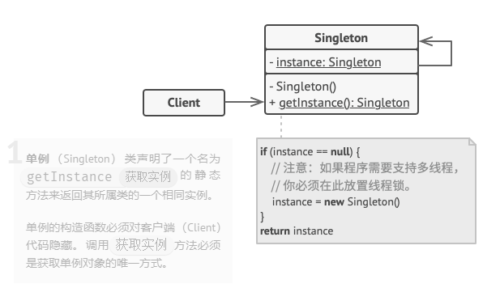
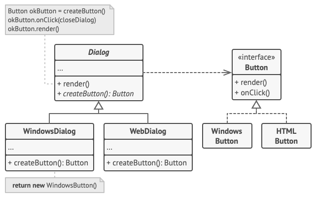
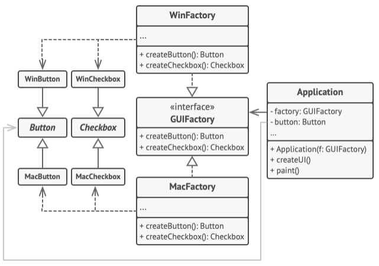
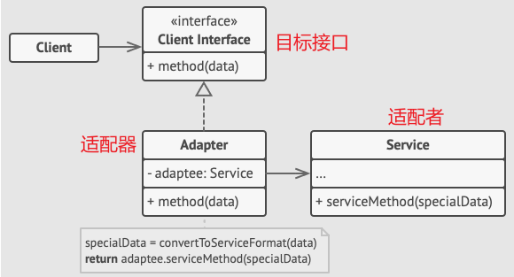
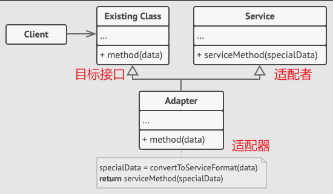
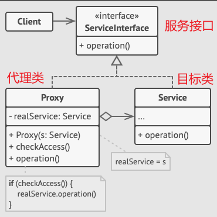
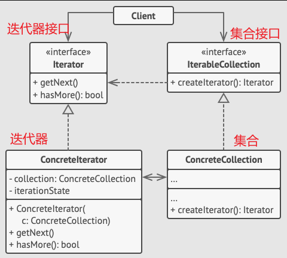
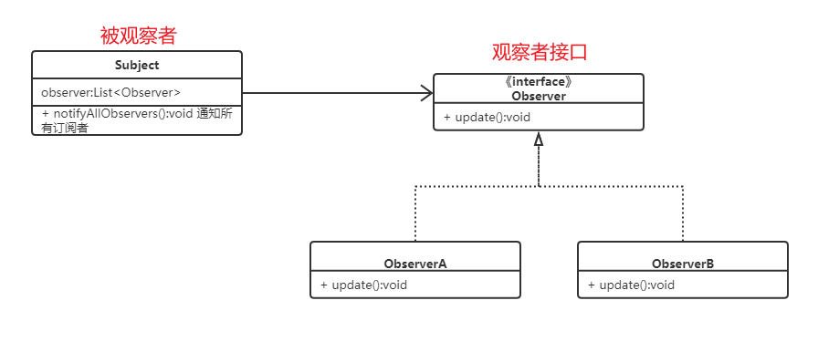

# 1 设计原则

## 1.1 单一职责

- **定义**：一个类应该只有一个引起它变化的原因，即只负责一项职责。
- **目的**：降低类的复杂度，提高可读性和可维护性，减少修改带来的副作用。
- **示例**：一个用户类（`User`）不应同时负责用户信息管理和日志记录，日志功能应单独交给日志类（`Logger`）。

## 1.2 开放 - 封闭

- **定义**：软件实体（类、模块、函数等）应该对扩展开放，对修改关闭。
- **目的**：通过扩展现有代码来实现新功能，而非修改已有代码，减少风险。
- **示例**：使用抽象基类定义接口，新增功能时只需实现新的子类，而非修改基类或现有子类。

## 1.3 里氏替换

- **定义**：子类对象必须能够替换其父类对象，且不影响程序的正确性。
- **目的**：保证继承关系的合理性，确保多态性的正确使用。
- **反例**：正方形类（`Square`）继承矩形类（`Rectangle`）后，修改边长可能破坏矩形 “长和宽独立设置” 的特性，导致替换后程序出错。

## 1.4 接口隔离

- **定义**：客户端不应依赖它不需要的接口，应将大接口拆分为多个小而专一的接口。
- **目的**：避免客户端被迫实现无用方法，减少接口之间的耦合。
- **示例**：一个 “多功能设备接口” 应拆分为 “打印接口”“扫描接口” 等，让仅需打印功能的类无需实现扫描方法。

## 1.5 依赖倒置

- **定义**：高层模块不应依赖低层模块，两者都应依赖抽象；抽象不应依赖细节，细节应依赖抽象。
- **目的**：通过抽象（接口或抽象类）隔离高层与低层模块，提高系统灵活性。
- **示例**：业务逻辑层（高层）不应直接依赖 MySQL 数据库（低层），而应依赖 “数据库接口”，MySQL 作为接口的实现类。

# 2 创建型

## 2.1 单例模式

单例模式保证一个类只有一个实例，并提供一个访问该实例的全局节点。单例模式分为饿汉式和懒汉式。饿汉式是在类加载阶段就创建实例，无需考虑线程安全问题，但会提前占用资源。懒汉式是在首次获取单例时创建实例，延迟初始化，提高启动速度，但处理线程安全问题。

**优点**

- 减少资源消耗：类只要一个实例，避免了频繁创建和销毁对象导致资源浪费。
- 保证全局状态一致性：所有操作都基于同一个实例，保证状态一致性。
- 简化全局访问：提供统一的静态方法获取实例，无需在代码中到处传递实例引用。

**缺点**

- 线程安全问题：需要添加同步操作保证线程安全。
- 提高耦合度

## 2.2 工厂模式

工厂模式将对象的创建和使用分离，从而降低代码耦合度、提高灵活性和可扩展性。

**简单工厂模式**

通过一个工厂类，根据传入的参数决定创建哪种产品实例。

**工厂方法模式**

为每个产品创建对应的工厂类，工厂基类定义创建产品的接口，具体工厂实现创建逻辑。

**抽象工厂模式**

抽象工厂模式用于创建一系列相关的对象。

优点

- 解耦：将对象创建逻辑与业务逻辑分离。
- 可扩展：符合“开闭原则”，便于新增产品。

缺点

- 引入新类，代码复杂度提高。

# 3 结构型

## 3.1 适配器模式

将一个类的接口转换为客户端期望的另一种接口，解决不兼容问题。

**对象适配器**

**类适配器**

**优点**

- 符合单一职责原则。
- 符合开闭原则。
- 提高代码复用性。

**缺点**

- 引入新类，代码复杂度提高。

## 3.2 代理模式

代理模式是为对象提供一个代理，通过代理控制对原对象的访问。

**优点**

- 实现客户端与目标类的解耦，客户端只与代理交互。
- 可在不修改目标类的前提下，灵活添加额外功能。（开闭原则）

**缺点**

- 微小性能损耗。

# 4 行为模式

## 4.1 迭代器模式

迭代器模式提供一种统一的方式来遍历对象，而无序暴露对象内部结构。

**优点**

- 简化遍历流程，无需暴露和修改集合。（开闭原则）
- 集合对象专注于数据存储，迭代器专注遍历，职责清晰。（单一职责）

## 4.2 观察者模式

观察者模式是一种订阅机制，可在被观察者发生某个时间时通知多个观察者。

**优点**

- 实现被观察者与观察者的解耦。
- 可扩展性强，新增观察者时，无需修改被观察者代码。

