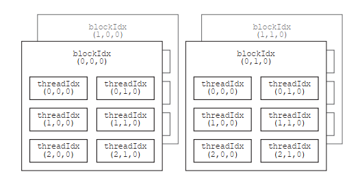
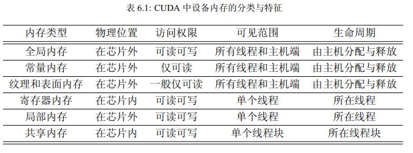
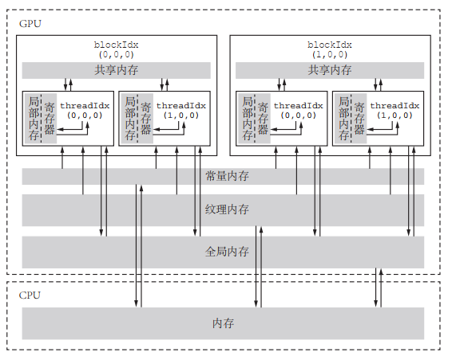
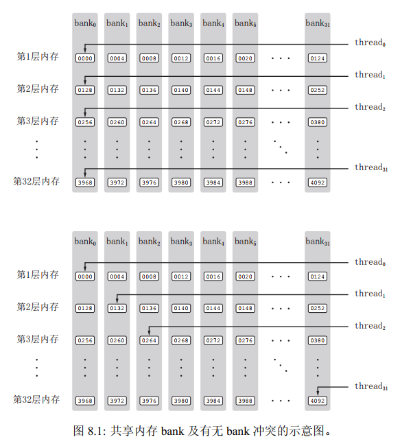

# 1 CPU硬件


 CPU拥有少数几个快速的计算核心，而GPU拥有几百到几千个不那么快速的计算核心。

在由CPU和GPU构成的异构计算平台中，将起控制作用的CPU称为主机（host），将起加速作用的GPU称为设备（device）。

# 2 CUDA基础

CUDA程序的编译器驱动nvcc在编译一个CUDA程序时，会将存粹的C++代码交给C++编译器，自己则负责编译剩下的部分。

## 2.1 函数类型

**核函数（global）**：一般由主机调用，在设备中执行。如果使用动态并行，则也可以在核函数中调用自己或其他核函数。返回类型必须是void。

**主机函数（host）**：主机端的普通C++函数，只能在主机中被调用，在主机中执行。

**设备函数（device）**：只能被核函数或其他设备函数调用，在设备中执行。可设置任意返回类型。

一个函数可以同时定义为主机函数和设备函数，编译器会针对主机和设备分别编译该函数。

## 2.2 核函数

### 2.2.1 线程组织

在调用核函数时，需要为核函数指定执行配置<<<grid_size, block_size>>>  ，即网格大小和线程块大小。网格大小和线程块大小可以是多维的，最多三维。

CUDA提供了内建变量，用于核函数中获取线程相关信息。

|   变量名    | 类型 |            含义            |
| :---------: | :--: | :------------------------: |
|   gridDim   | dim3 |     网格中线程块的数量     |
|  blockDim   | dim3 |     线程块中线程的数量     |
|  blockIdx   | dim3 | 当前线程块在其网格中的索引 |
|  threadIdx  | dim3 | 当前线程在其线程块中的索引 |
|  warpSize   | int  |     warp 中线程的数量      |
| activeWarps | int  |  当前块中活跃的 warp 数量  |



### 2.2.2 核函数的要求

- 返回类型必须是void
- 必须使用限定符
- 支持重载
- 不支持可变数量的参数列表
- 可以向核函数传递非指针变量
- 除非使用统一内存编程机制，否则传给核函数的数组（指针）必须指向设备内存。
- 核函数不可成为一个类的成员
- 从计算能力 3.5 开始，引入了动态并行（dynamic parallelism）机制，在核函数内部可以调用其他核函数，甚至可以递归
- 无论是从主机调用，还是从设备调用，核函数都是在设备中执行。调用核函数时必须指定执行配置。

## 2.3 CUDA程序的基本框架

1. 分配主机域设备的内存
2. 初始化主机中的数据
3. 将某些数据从主机复制到设备
4. 调用核函数在设备中进行计算
5. 将某些数据从设备复制到主机
6. 释放主机与设备内存

## 2.4 SM

SM叫流式多处理器。一个GPU是由多个SM构成的。

软件层面：在执行核函数时，需要指定网格大小和线程大小。

硬件层面：一个GPU有多个SM，一个SM可以处理多个线程块，一个线程块只能在一个SM中处理，SM将线程块分为线程束，线程束是CUDA中调度的基本单位，一个线程束包含32个线程。

## 2.5 同步

线程块同步：

```c++
/*
保证一个线程块中的所有线程在执行该语句后面的语句之前都完全执行了该语句前面的语句
*/
__syncthreads()
```

线程束同步：

```c++
void __syncwarp(unsigned mask = 0xffffffff);
```

## 2.6 原子操作

**原子性**：原子操作是不可分割的操作，即在执行这个操作的过程中，其他线程不会干扰它。

性能：由于原子操作通常是在硬件层面是实现的，所以一般比使用锁更高效。

## 2.7 线程束

伏特架构之前，一个线程束中的线程拥有同一个程序计数器，但各自有不同的寄存器状态，从而可以根据程序的逻辑判断选择不同的分支。虽然可以选择分支，但是在执行时，各个分支是依次顺序执行的。在同一时刻，一个线程束中的线程只能执行一个共同的指令或者闲置，这称为**单指令-多线程**的执行模式。当一个线程束中的线程顺序地执行判断语句中不同的分支时，称为**分支分散**。

伏特架构引入**独立线程调度机制**，每个线程有自己的程序计数器。

线程束基本函数：线程束表决函数、线程束匹配函数、线程束洗牌函数。

**协作组**提供了灵活的线程协作方式，包括线程块内部的同步与协作、线程块之间的同步与协作及设备之间的同步与协作。

```C++
/*
运行时确定
*/
thread_group group = tiled_partition(this_thread_block(),8);

/*
编译时确定
*/
thread_block_tile<8> tile = tiled_partition<8>(this_thread_block());
```

## 2.8 CUDA流

CUDA程序的并行层次主要有两个，一个是核函数内部的并行，一个是核函数外部的并行。

CUDA流指的是由主机发出的在一个设备中执行的CUDA操作（主机-设备的数据传输、核函数执行）。一个CUDA流中各个操作的执行次序按照主机发布的次序执行。不同CUDA流中的操作可能是并发执行，也可能是交错执行。

任何CUDA操作都必须存在于某个CUDA流中，主机发布操作时可以指定流，若没有指定，则发布于默认流（空流）中。

从主机角度来看，CUDA操作可以是同步的，也可以是异步的。在使用异步的数据传输函数时，需要将主机内存定义为**不可分页内存**（**固定内存**）。不可分页主机内存的分配可以由CUDA运行时API函数实现。

## 2.9 统一内存编程

统一内存是一种逻辑上的概念，它既不是显存，也不是主机的内存，而是一种系统中的任何处理器都可以访问，并且保证一致性的存储器。

统一内存有以下优点：

- 编程更加简单
- 可能提高性能。统一内存的底层实现自动将数据放置到离存储器更近的位置，如部分放置于显存，部分放置于内存
- 允许超量分配

但是统一内存对硬件要求较高，则其新特性需要在linux系统中才可以使用。

# 3 CUDA的内存组织





## 3.1 全局内存

使用cudaMalloc函数可以申请全局内存。


**静态全局内存变量**：

```c++
__device__ int x = 0;
```

在核函数中，可以直接对静态全局内存变量进行访问。不可在主机函数中直接访问静态全局内存变量，但可以用cudaMemcpyToSymbol函数cudaMemcpyFromSymbol函数在静态全局内存和主机内存之间传递数据。

## 3.2 纹理内存

某些只读全局内存数据用ldg函数通过只读数据缓存读取，可以达到使用纹理内存的加速效果。帕斯卡以上架构，全局内存的读取会默认使用该函数。

```c++
 T __ldg(const T *ptr);
```

## 3.3 常量内存

```C++
__constant__ int x;
```

主机端操作常量内存的方式与操作静态全局内存变量相同。

## 3.4 共享内存

分配**共享内存**：

```c++
__shared__ int x;
```

分配**动态共享内存**：

在调用核函数的执行配置中填写第三个参数，代表核函数中每个线程块需要定义的共享内存的字节数，然后在核函数中使用extern关键字声明动态共享内存。

```
<<<grid_size, block_size, sizeof(real) * block_size>>>
__shared__ real s_y[128];
```

## 3.5 局部内存

从硬件看，局部变量只是全局内存的一部分。从用法看，局部内存和寄存器几乎一样。核函数定义的变量可能分配在局部内存，也可能分配在寄存器。这取决于变量的大小，变量较小则存储与寄存器、变量较大则存储于局部变量，这种判断是由编译器自动进行的。

## 3.6 寄存器

在核函数中定义的变量一般来说就存放于寄存器中。

## 3.7 L1和L2缓存

L1缓存位于SM，L2缓存位于设备，它们主要用来缓存全局内存和局部内存的访问，减少延迟。

#  4 CUDA程序优化

## 4.1 全局内存的合理使用

全局内存一次数据传输处理的数据量在默认情况下是32字节。

**合并度** = 线程束访问（读or写）的字节数 / 由该访问所导致的所有数据传输的字节数。 

合并度等于百分比时，即为**合并访问**、反之为**非合并访问**。

编写的CUDA程序要尽可能做到合并访问，即**数据传输的内容全部为线程束所需要的**。

## 4.2 共享内存的合理使用

共享内存的主要作用有两个：

- 减少核函数对全局内存的访问，实现高效的内存块内部通信
- 提高全局内存访问的合并度

避免共享内存的**bank冲突**：



## 4.3 其他优化方法

### 4.3.1 内存管理

1. 合理使用共享内存，减少bank冲突
2. 合理使用全局内存，尽可能进行合并访问
3. 减少主机和设备之间的内存拷贝
4. 特定硬件设备可以使用统一内存编程

### 4.3.2 计算资源

1. 提高核函数计算强度
2. 合理制定核函数执行配置

### 4.3.3 并发执行

1. 使用CUDA流合理实现数据传输和核函数并发执行

### 4.3.4 同步优化

1. 使用低级别的同步函数
2. 使用原子操作

### 4.3.5 算法优化

1. 减少分支发散

### 4.3.6 编译优化

1. 合理指定算力
2. 开启编译优化

# 5 CUDA架构列表：

| 架构代号                      | 发布年份 | 主计算能力 |
| ----------------------------- | -------- | ---------- |
| 特斯拉（Tesla）               | 2006     | 1          |
| 费米（Fermi）                 | 2010     | 2          |
| 开普勒（Kepler）              | 2012     | 3          |
| 麦克斯韦（Maxwell）           | 2014     | 5          |
| 帕斯卡（Pascal）              | 2016     | 6          |
| 伏特（Volta）                 | 2017     | 7          |
| 图灵（Turing）                | 2018     | 7.5        |
| 安倍（Ampere）                | 2020     |            |
| 阿达·洛夫莱斯（Ada Lovelace） | 2022     |            |
