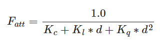

# 1.光照

## 1.1.颜色

定义：物体从一个光源反射各个颜色分量的大小。

## 1.2.风氏光照模型（Phong Lighting Model）

风氏光照模型的主要结构由3个分量组成：

- **环境光照**：即使在黑暗的情况下，世界上通常也仍然有一些光亮（月亮、远处的光），所以物体几乎永远不会是完全黑暗的。为了模拟这个，我们会使用一个环境光照常量，它永远会给物体一些颜色。
- **漫反射光照**：模拟光源对物体的方向性影响(Directional Impact)。它是风氏光照模型中视觉上最显著的分量。物体的某一部分越是正对着光源，它就会越亮。
- **镜面光照**：模拟有光泽物体上面出现的亮点。镜面光照的颜色相比于物体的颜色会更倾向于光的颜色。

### 1.2.1.环境光照

环境光照添加到场景里非常简单，只需要使用光的颜色乘以一个很小的常量环境因子，再乘以物体的颜色。

### 1.2.2.漫反射光照


光源坐标 片段坐标 **--相减-->** 光源指向片段的向量 法线 **--点乘-->** cos夹角 光源颜色 物理颜色 **--相乘->** 漫反射光照

### 1.2.3.镜面光照


## 1.3.材质

**材质颜色**：

通过设置环境光照的颜色、漫反射光照颜色、镜面光照颜色和反光度（Shininess）分量来定义一个材质。

```C++
struct Material {
    vec3 ambient;		//环境光照颜色
    vec3 diffuse;		//漫反射光照颜色
    vec3 specular;		//镜面光照颜色
    
    float shininess;	//反光度
}; 
```

可以使用光照贴图中的漫反射贴图和镜面贴图设置漫反射光照颜色和镜面光照颜色。（环境光照颜色在几乎所有情况下都等于漫反射颜色，所以不需要将它们分开存储）

```C++
struct Material {
    sampler2D diffuse;
    sampler2D specular;
    float     shininess;
};
```

## 1.4.投光物

### 1.4.1.平行光/定向光

当光源处于很远的地方时，来自光源的每条光线就会近似于互相平行。无论物体或观察者位于哪里，看起来好像所有的光都来自同一个方向。

```C++
struct Light {
    vec3 position;	//位置

    vec3 ambient;	//环境光
    vec3 diffuse;	//漫反射光
    vec3 specular;	//镜面反射光
};
```


```c++
struct Light {
    vec3 direction;	//方向

    vec3 ambient;	//环境光
    vec3 diffuse;	//漫反射光
    vec3 specular;	//镜面反射光
};
```

注：当我们使用vec4表示位置向量时，w分量设为1.0才能正确应用变换和投影。若表示方向向量，则将w设置为0.0。这也可以作为一个快速检测光照类型的工具：你可以检测w分量是否等于1.0，来检测它是否是光的位置向量；w分量等于0.0，则它是光的方向向量，这样就能根据这个来调整光照计算了：

```c++
if(lightVector.w == 0.0) // 注意浮点数据类型的误差
  // 执行定向光照计算
else if(lightVector.w == 1.0)
  // 根据光源的位置做光照计算（与上一节一样）
```

### 1.4.2.点光源


**衰减**（Attenuation）：随着光线传播距离的增长逐渐消减光的强度




### 1.4.3.聚光

聚光是位于环境中某个位置的光源，它只朝一个特定方向而不是所有方向照射光线。OpenGL中聚光是用一个世界空间位置、一个方向、一个切角来表示的。


**平滑/软化边缘**

为了创建一个外圆锥，我们只需要再定义一个余弦值来代表聚光方向向量和外圆锥向量（等于它的半径）的夹角。然后，如果一个片段处于内外圆锥之间，将会给它计算出一个0.0到1.0之间的强度值。如果片段在内圆锥之内，它的强度就是1.0，如果在外圆锥之外强度值就是0.0。


