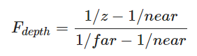
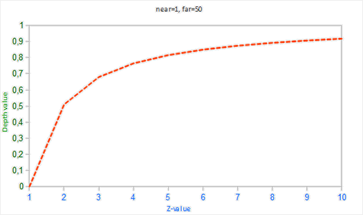

# 1.深度测试

## 1.1.原理

每个片段都会有一个深度值，深度值以16、24或32位float的形式存储。另外存储一个深度缓冲，深度缓冲（z缓冲）存储了一个深度值，初始为1。OpenGL会执行深度测试，如果测试通过，深度缓冲存储的深度值将会更新为片段的深度值，如果测试失败，片段将被丢弃。

## 1.2.使用

**启动深度测试**

```C++
glEnable(GL_DEPTH_TEST);
```

**关闭深度测试**

```
glDisable(GL_DEPTH_TEST);
```

**每次渲染迭代之前清除深度缓冲**

```c++
glClear( ... | GL_DEPTH_BUFFER_BIT);
```

**设置用什么值来清除深度缓存**

```C++
void glClearDepth(GLdouble depth)
```

**启用/禁用深度缓冲的写入**

```c++
void glDepthMask(GLboolean flag);
```

**设置深度测试比较符**

```c++
glDepthFunc(GL_LESS);	//默认是GL_LESS
```

## 1.3.扩展

### 1.3.1.深度值精度

OpenGL会将观察者所看到的场景中所有的物体的z值转换为深度值。观察空间中可见物体的z值位于投影平截头体的近平面和远平面之间，而深度值范围是0.0~1.0，所以需要一个方程将z值转换为深度值。

**线性方程：**


near：投影平截头体的近平面

far：投影平截头体的远平面

**非线性方程：**





由于近处需要更高的精度，所以使用非线性方程更加合适。

### 1.3.2.深度缓冲的可视化

片段着色器中的内建**gl_FragCoord**三维向量，xy值表示当前绘制的片段在屏幕上的位置，z值表示了该片段的深度值。将这个深度值输出为颜色，即可实现深度缓冲的可视化。

```C
void main()
{
    FragColor = vec4(vec3(gl_FragCoord.z), 1.0);
}
```

### 1.3.3.深度冲突

两个平面或者三角形非常紧密的平行排列在一起时，深度缓冲没有足够的精度来决定两个形状哪个在前面，导致两个形状不断地切换前后顺序，这个现象就叫深度冲突。

防止深度冲突：

- 不要把多个物体摆得太靠近
- 尽可能将近平面设置得远一些
- 使用更高精度的深度缓冲（32位的深度值）

## 1.4.疑问

<!--禁用深度缓冲的写入之后，那么一开始的深度缓冲是怎么设置的呢？-->

<!--深度测试的时机？-->

<!--默认的深度缓冲是使用线性方程还是非线性方程？如何改变方程？-->

